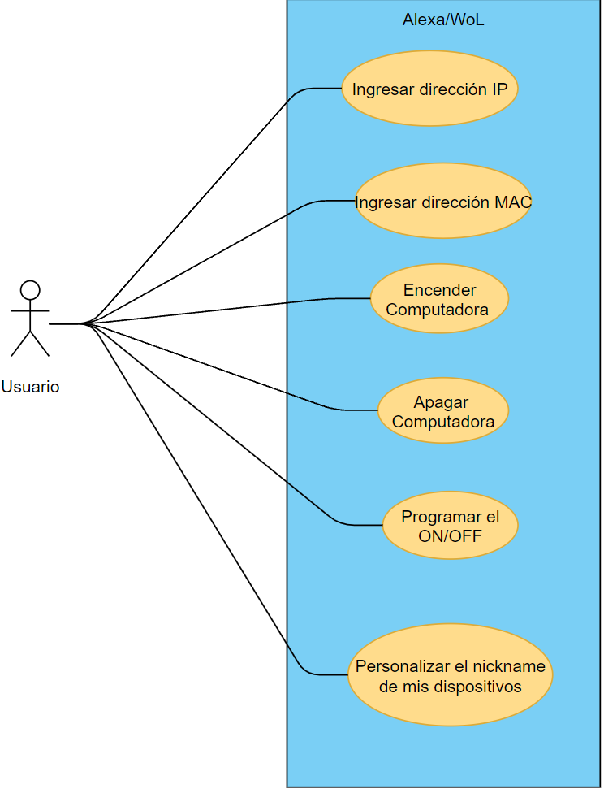

# **ALEXA SKILL - WAKE ON LAN**
### Descripción de la aplicación:
#### **OBJETIVO**
---
Implementar en Amazon Alexa, mediante la tienda de skills, el uso del protocolo WoL (Wake on LAN) para realizar el encendido y apagado remoto, de computadoras compatibles o televisores , de manera automática usando la voz. 

#### **ALCANCE DEL PROYECTO**

* Global, o en su defecto, personas que cuenten con dispositivos Alexa Echo.

#### **LIMITACIONES DEL PROYECTO**

* La posibilidad de que los dispositivos no sean compatibles con el protocolo WoL.
* Incapacidad de uso fuera de la Alexa Skill.
* Contenidos en español (tutoriales, plataforma web/bot).

#### **USUARIOS**
---

Determinamos que los usuarios de nuestra skill son todos aquellas personas que tengan un dispositivo Amazon Alexa o la aplicación de Alexa y por consiguiente tengan acceso a la tienda de skills. Según las estadísticas de los altavoces inteligentes, Amazon Echo tuvo 40,6 millones de usuarios en 2020, más que Google Home y otros usuarios de altavoces inteligentes juntos. Instalar un Amazon Echo en tu casa significa que tendrás que utilizar la aplicación Alexa. Algunos de los principales aspectos del uso de Alexa son su disponibilidad, sus prácticas funciones y el uso de datos. 

*Crecimiento estimado de usuarios potenciales*
* Según estadísticas de Amazon Alexa 2020, se vendieron 53,6 millones de altavoces Amazon Echo en el mismo año. Se espera que el número aumente a 65 millones en 2021.

#### **CLIENTES**
---

Como tal nosotros no tenemos un cliente específico porque detrás del proyecto no hay ninguna persona externa interesada por el desarrollo. Por lo cual decidimos que básicamente nuestros futuros usuarios serán considerados como nuestros clientes. Por lo cual usaremos encuestas y formularios para sondear a los potenciales clientes y ser capaces de proporcionar de una buena manera las exigencias y caracteristicas que demanda un cliente para darle profundidad al desarrollo del proyecto. 

#### **INNOVACIÓN/CREATIVIDAD**
---
Los asistentes virtuales no se crearon con el fin de satisfacer necesidades, se crearon para facilitarle la vida a los usuarios en tareas simples, como obtener información rápida, leer un libro o controlar la reproducción de música.

Ya hay una aplicación existente de Wake On Lan, pero la calidad de esta es muy baja y no cumple con su cometido. Esta skill tiene reseñas muy bajas, contando con una calificación de 2.5 estrellas entre más de 150 reseñas de usuarios, es una skill que no está ordenada ni claras sus instrucciones, llegando a fallar con su propósito principal, haciéndola una opción poco viable para la cantidad de usuarios que desearían tener esta skill funcional.

A parte de la anterior mencionada, no existe otra aplicación similar que aproveche la tecnología Wake on Lan, haciendo que si logramos hacer un sistema funcional, atractivo y eficiente, sería la aplicación principal de esta tecnología en el servicio de Amazon, Alexa. No se busca crear algo completamente nuevo, sino ofrecer una mejor alternativa a un producto ya existente.

Buscamos agilizar el encendido y apagado de las computadoras y laptops, utilizando la función de wake on lan que tienen los dispositivos, siendo compatible con la mayoría de los sistemas operativos tantos actuales como más antiguos (Windows xp, vista , 7), mediante el asistente virtual Alexa podemos iniciar esta función con un simple comando de voz, desde cualquier lugar mediante nuestro dispositivo móvil optimizando tiempos de espera para poder iniciar a usar la computadora.

### **REQUERIMIENTOS Y/O HISTORIAS DE USUARIO**

#### **HISTORIAS DE USUARIO**

Las historias de usuario son una forma de buscar necesidades y preferencias que desean los usuarios y/o clientes a los que va dirigido nuestro proyecto, formulamos muchas de las que tenemos mediante reseñas de una skill parecida y testimonios de usuarios interesados. Decidimos hacerlas al igual que los requerimientos ya que es igual importante el feedback de la gente para un proyecto con constante mantenimiento.

* Como usuario de Alexa, quiero ser capaz de encender mi computadora desde el baño para poder aprovechar más mi tiempo.

* Como usuario de Alexa, quiero poder automatizar el encendido de mi computadora para ser más eficiente.

* Como usuario de Alexa, quiero automatizar el apagado de mi computadora para ahorrar tiempo en mi día a día.

* Como usuario de Alexa, quiero poder controlar varios dispositivos para tener un mayor control y conveniencia.

* Como usuario de Alexa, quiero programar un horario de encendido para que mis dispositivos estén acoplados a mi rutina y pueda aprovechar mi tiempo al máximo.

* Como usuario de Alexa, quiero ser capaz de personalizar el nombre a los dispositivos para que el control de ellos sea más fácil

* Como usuario de Alexa, quiero tener instrucciones para que me ayuden a poder implementar la skill.

* Como usuario de Alexa, quiero poder realizar preguntas para que me ayuden a resolver mis dudas

* Como usuario de Alexa, quiero poder controlar otros dispositivos como televisiones para tener un mayor control sobre todos mis dispositivos.

#### **ESPECIFICACIÓN DE REQUERIMIENTOS**

Los requerimientos son un instrumento fundamental en el correcto desarrollo de un proyecto de software. Son de gran ayuda, tanto para el cliente como el equipo de desarrollo, para tener una visión concisa de que características se requiere que tenga el producto y como estas se relacionan con el usuario.

Debido a la simpleza que representa la ejecución de nuestro producto, no hay una gran cantidad de requerimientos que podamos idear, pero los hicimos de manera que cumplan con las caracteristicas principales de un requisito. Tras un extendido proceso de discusión, elaboración y verificación, hemos concordado en los siguientes requisitos para nuestro proyecto:

* RF001: La skill podrá controlar el menu de opciones de encendido y apagado de los dispositivos compatibles con el protocolo WoL a través de el asistente Alexa.

   * (RNF): El usuario podrá controlar la skill desde cualquier dispositivo con Alexa.

   * (RNF): El usuario podrá especificar el tipo de acción a realizar: inicio, apagado, suspensión, reinicio e hibernar.

* RF002: Se implementará los servicios de Microsoft Azure para hostear y manejar la base datos de la aplicación web donde se introducirán las direcciones IP/MAC de los dispositivos.

   * (RNF): La plataforma Azure le notificará a los desarolladores de algún error con la aplicación.

   * (RNF): Solo los desarrolladores tienen acceso a la base de datos/plataforma.

   * (RNF): El usuario tendrá que loguearse con su cuenta de Amazon para vincular sus datos con alexa.

* RF003: Se usará un bot asistente para ayudar al usuario a introducir la dirección IP y MAC dentro de su base de datos.

   * (RNF): El bot asistirá por medio de un tutorial, la manera en la que se deben ingresar las direcciones correspondientes.

   * (RNF): A manera de “pop up” el bot emitirá un mensaje en caso de ingresar alguna dirección IP/MAC erronea.

* RF004: Se contará con un tutorial para mostrarle a lo usuarios como inicializar la alexa skill dentro de sus dispositivos.

   * (RNF): El tutorial se abrirá autómaticamente cuando el usuario indique las direcciones correspondientes dentro de la base de datos del bot.

#### **MÉTODO DE PRIORIDAD**

Utilizamos el metodo MoSCoW para priorizar los requerimientos y las historias de usuario. Este metodo se integra muy bien a nuestro equipo y proyecto debido a la metodologia agil que utilizamos. La priorizacion que maneja MoSCoW se divide en 4 categorias:

* Must Have: Caracteristicas sin las cuales el proyecto no puede funcionar

* Should Have: Caracteristicas que son importantes en el proyecto, pero que no son indispensables

* Could Have: Caracteristicas que aumentarian el valor del proyecto si se tienen, pero que no son de gran importancia

* Won't have: Caracteristicas que no son importantes en el presente, pero que podrian implementarse mas tarde

Para que la priorizacion fuera lo mas eficiente posible, realizamos una sesion con el proyect owner para discutir en donde deberia ir cada una, basado en que tan factible es su implementacion. A continuacion se pueden apreciar los resultados de esa discusion:

### REQUIRIMIENTOS:
#### Must have:
* La skill podrá controlar el menu de opciones de encendido y apagado de los dispositivos compatibles con el protocolo WoL a través de el asistente Alexa.
* Solo los desarrolladores tienen acceso a la base de datos/plataforma.
* El usuario podrá controlar la skill desde cualquier dispositivo con Alexa.
* El usuario podrá especificar el tipo de acción a realizar: inicio, apagado, suspensión, reinicio e hibernar.
* El usuario tendrá que loguearse con su cuenta de Amazon para vincular sus datos con alexa.
#### Should have:
* Se contará con un tutorial para mostrarle a lo usuarios como inicializar la alexa skill dentro de sus dispositivos.
* Se usará un bot asistente para ayudar al usuario a introducir la dirección IP y MAC dentro de su base de datos.
#### Could have:
* El bot asistirá por medio de un tutorial, la manera en la que se deben ingresar las direcciones correspondientes.
* El tutorial se abrirá autómaticamente cuando el usuario indique las direcciones correspondientes dentro de la base de datos del bot.
* Se implementará los servicios de Microsoft Azure para hostear y manejar la base datos de la aplicación web donde se introducirán las direcciones IP/MAC de los dispositivos.
* La plataforma Azure notificará a los desarolladores de algún error con la aplicación.
#### Won't have but would like to in the future:
* A manera de “pop up” el bot emitirá un mensaje en caso de ingresar alguna dirección IP/MAC erronea.

### HISTORIAS DE USUARIO:
#### Must have:
* Como usuario de Alexa, quiero poder automatizar el encendido/apagado de mi computadora para ser más eficiente.
* Como usuario de Alexa, quiero ser capaz de encender mi computadora desde otro sitio para poder aprovechar más mi tiempo.
#### Should have:
* Como usuario de Alexa, quiero poder controlar otros dispositivos como televisiones para tener un mayor control sobre todos mis dispositivos.
* Como usuario de Alexa, quiero tener instrucciones para que me ayuden a poder implementar la skill.
#### Could have:
* Como usuario de Alexa, quiero programar un horario de encendido para que mis dispositivos estén acoplados a mi rutina y pueda aprovechar mi tiempo al máximo.
* Como usuario de Alexa, quiero ser capaz de personalizar el nombre a los dispositivos para que el control de ellos sea más fácil.
* Como usuario de Alexa, quiero controlar varios dispositivos para tener un mayor control y conveniencia.
#### Won't have but would like to in the future:
* Como usuario de Alexa, quiero poder realizar preguntas dentro del área de comentarios de la skill que me ayuden a resolver mis dudas.

### **DIAGRAMA DE CASOS DE USO**

### **ARTEFACTOS UTILIZADOS POR EL EQUIPO DE DESARROLLO**
---

* [X] Formulario.
* [X] Diagrama de casos de uso.
* [X] Excepcinones de casos de uso.
* [X] Lluvia de ideas.

### **EXCEPCIONES DE CASOS DE USO**

1. Si el ususario quiere nombrar a 2 dispositvos de la misma forma, el sistema le avisará que ya existe un dispositivo con ese nombre

2. En el caso de que no pudiera conectarse con el dispositivo, la skill le notificará al usuario que hubo un error

3. Si el usuario le dice un nombre de dispositivo que no reconoce, el sistema le avisara al usuario que no existe ese dispositivo

4. En el caso de que el usuario introduzca una dirección IP y/o Mac erronea, el sistema le notificara que la conexión no fue exitosa

## **PROCESO DE DESARROLLO**

### Metodología

La metodología implementada para la realización del proyecto se basó en "SCRUM", la cual **se adaptó al proyecto** por ser conocida como una metodología ágil, esta se concentra en como los miembros del equipo deberÌan funcionar a fin de producir un sistema flexible en un entorno que cambia constantemente.

En un inicio, se estableció una reunión para conocer las habilidades del equipos y las ideas que cada integrante deseaba aplicar al proyecto, la cual mediante una votación fue seleccionada.

Posteriormente , y dentro del Product backlog , se estableció una especie de rutina en donde el Product Owner establecia y priorizaba las tareas a realizar, de esta manera se generó un plan de 2 sprints los cuales se realizaban en el plazo de no más de 2 semanas (por sprint). Dentro del proceso, el contenido se creaba en forma de "borrador" pues en principio se realizaba dentro de un Google Docs para que después el Producto Owner y los miembros del equipo validen la información, acto seguido, se introduzca dentro del branch del integrante que lo realizó (Github). Para controlar el progreso, se realizaban 2 sesiones a la semana, sin embargo en caso de necesitarse alguna revisión extra o cambio en la información dentro del repositorio, el Product Owner realizaba reuniones especificas con los integrantes correpondientes para tratar los tópicos a cambiarse o renovarse. Al finalizar cada proceso de los sprints se realizaba "un sprint retrospective meeting" de duración de 30 minutos y, en su defecto, cada miembro del equipo compartía sus dificultades y logros dentro del proyecto. Para la medición y manejo de las actividades dentro de los sprints se utilizó la herramienta Monday.com.

### Roles del equipo:

Product Owner:

* Pablo Gamboa Nieto.

SCRUM masters:

* Diego Francisco Arreola Hernández.

* José De Jesús Chi Quintal.

SCRUM team:

* Abraham Raymundo Cruz Colli.

* Diego Alamilla Osorio.

~~Se estableció una adaptación hacia los roles que asigna la metodología SCRUM, pues al rol del Product Owner se le agregó la creación del repositorio Github. En el caso de los SCRUMS masters: facilitar las llamadas y ayudar a asignar las tareas a cada miembro de equipo y, en su defecto, la actualización de la herramienta Monday de manera activa (en lapso de menos de 3 días).~~

