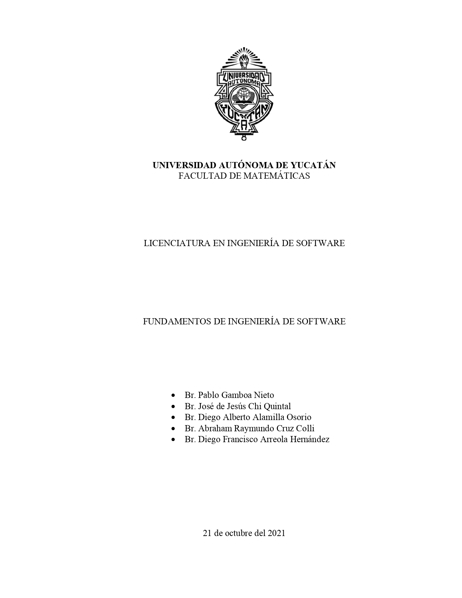
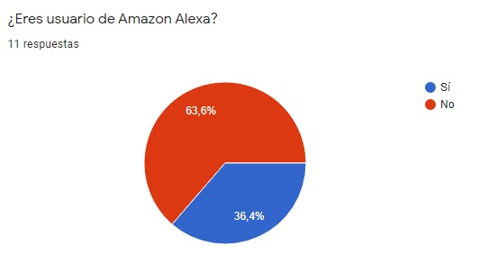
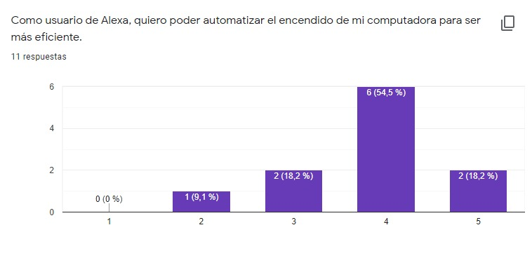
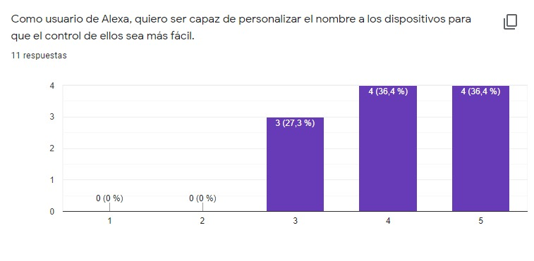

# **ALEXA SKILL - WAKE ON LAN**

 

## **Descripción de la aplicación:**
 

### **OBJETIVO**
---
Implementar en Amazon Alexa, mediante la tienda de skills, el uso del protocolo WoL (Wake on LAN) para realizar el encendido y apagado remoto, de computadoras compatibles o televisores, de manera automática usando la voz. 

#### **ALCANCE DEL PROYECTO**

* Global.

#### **LIMITACIONES DEL PROYECTO**

* La posibilidad de que los dispositivos no sean compatibles con el protocolo WoL.
* Incapacidad de uso fuera de la Alexa Skill.
* Contenidos en español (tutoriales, plataforma web/bot).

### **USUARIOS**
---

Determinamos que los usuarios de nuestra skill son todos aquellas personas que tengan un dispositivo Amazon Alexa o la aplicación de Alexa y por consiguiente tengan acceso a la tienda de skills. Según las estadísticas de los altavoces inteligentes, Amazon Echo tuvo 40,6 millones de usuarios en 2020, más que Google Home y otros usuarios de altavoces inteligentes juntos. Instalar un Amazon Echo en tu casa significa que tendrás que utilizar la aplicación Alexa. Algunos de los principales aspectos del uso de Alexa son su disponibilidad, sus prácticas funciones y el uso de datos. 

*Crecimiento estimado de usuarios potenciales*
* Según estadísticas de Amazon Alexa 2020, se vendieron 53,6 millones de altavoces Amazon Echo en el mismo año. Se espera que el número aumente a 65 millones en 2021.

### **CLIENTES**
---

Como tal nosotros no tenemos un cliente específico porque detrás del proyecto no hay ninguna persona externa interesada por el desarrollo. Por lo cual decidimos que básicamente nuestros futuros usuarios serán considerados como nuestros clientes. Por lo cual usaremos encuestas y formularios para sondear a los potenciales clientes y ser capaces de proporcionar de una buena manera las exigencias y características que demanda un cliente para darle profundidad al desarrollo del proyecto. 

### **INNOVACIÓN/CREATIVIDAD**
---
Los asistentes virtuales no se crearon con el fin de satisfacer necesidades, se crearon para facilitarle la vida a los usuarios en tareas simples, como obtener información rápida, leer un libro o controlar la reproducción de música.

Ya hay una aplicación existente de Wake On Lan, pero la calidad de esta es muy baja y no cumple con su cometido. Esta skill tiene reseñas muy bajas, contando con una calificación de 2.5 estrellas entre más de 150 reseñas de usuarios, es una skill que no está ordenada ni claras sus instrucciones, llegando a fallar con su propósito principal, haciéndola una opción poco viable para la cantidad de usuarios que desearían tener esta skill funcional.

A parte de la anterior mencionada, no existe otra aplicación similar que aproveche la tecnología Wake on Lan, haciendo que si logramos hacer un sistema funcional, atractivo y eficiente, sería la aplicación principal de esta tecnología en el servicio de Amazon, Alexa. No se busca crear algo completamente nuevo, sino ofrecer una mejor alternativa a un producto ya existente.

Buscamos agilizar el encendido y apagado de las computadoras y laptops, utilizando la función de Wake on Lan que tienen los dispositivos, siendo compatible con la mayoría de los sistemas operativos tantos actuales como más antiguos (Windows xp, vista , 7), mediante el asistente virtual Alexa podemos iniciar esta función con un simple comando de voz, desde cualquier lugar, mediante nuestro dispositivo móvil, optimizando tiempos de espera para poder iniciar a usar la computadora.

 

## **Requerimientos e Historias de Usuario**
---
### **MÉTODO DE PRIORIDAD**
---

Utilizamos el método MoSCoW para priorizar los requerimientos y las historias de usuario. Este método se integra muy bien a nuestro equipo y proyecto debido a la metodología ágil que utilizamos. La priorización que maneja MoSCoW se divide en 4 categorias:

* Must Have: Características sin las cuales el proyecto no puede funcionar

* Should Have: Características que son importantes en el proyecto, pero que no son indispensables

* Could Have: Características que aumentarían el valor del proyecto si se tienen, pero que no son de gran importancia

* Won't have: Características que no son importantes en el presente, pero que podrían implementarse más tarde

Para que la priorización fuera lo más eficiente posible, realizamos una sesión con el proyect owner para discutir en donde debería ir cada una, basado en que tan factible es su implementación. A continuación se pueden apreciar los resultados de esa discusión:

### **HISTORIAS DE USUARIO**
Las historias de usuario son una forma de buscar necesidades y preferencias que desean los usuarios y/o clientes a los que va dirigido nuestro proyecto, formulamos muchas de las que tenemos mediante reseñas de una skill parecida y testimonios de usuarios interesados. Decidimos hacerlas al igual que los requerimientos ya que es igual importante el feedback de la gente para un proyecto con constante mantenimiento.

* HU001: Como usuario de Alexa, quiero poder automatizar el encendido/apagado de mi computadora para ser más eficiente. **(M)**
* HU002: Como usuario de Alexa, quiero ser capaz de encender mi computadora desde otro sitio para poder aprovechar más mi tiempo. **(M)**
* HU003: Como usuario de Alexa, quiero poder controlar otros dispositivos como televisiones para tener un mayor control sobre todos mis dispositivos. **(S)**
* HU004: Como usuario de Alexa, quiero tener instrucciones para que me ayuden a poder implementar la skill.  **(S)**
* HU005: Como usuario de Alexa, quiero programar un horario de encendido para que mis dispositivos estén acoplados a mi rutina y pueda aprovechar mi tiempo al máximo. **(C)**
* HU006: Como usuario de Alexa, quiero ser capaz de personalizar el nombre a los dispositivos para que el control de ellos sea más fácil. **(C)**
* HU007: Como usuario de Alexa, quiero controlar varios dispositivos para tener un mayor control y conveniencia. **(C)**
* HU008: Como usuario de Alexa, quiero poder realizar preguntas dentro del área de comentarios de la skill que me ayuden a resolver mis dudas. **(W)**

### **ESPECIFICACIÓN DE REQUERIMIENTOS**

Los requerimientos son un instrumento fundamental en el correcto desarrollo de un proyecto de software. Son de gran ayuda, tanto para el cliente como el equipo de desarrollo, para tener una visión concisa de que características se requiere que tenga el producto y como estas se relacionan con el usuario.

Debido a la simpleza que representa la ejecución de nuestro producto, no hay una gran cantidad de requerimientos que podamos idear, pero los hicimos de manera que cumplan con las características principales de un requisito. Tras un extendido proceso de discusión, elaboración y verificación, hemos concordado en los siguientes requisitos para nuestro proyecto:

* RF001: La skill podrá controlar el menu de opciones de encendido y apagado de los dispositivos compatibles con el protocolo WoL a través de el asistente Alexa. (HU001, HU002, HU003, HU005) **(M)**

   * (RNF001): El usuario podrá controlar la skill desde cualquier dispositivo con Alexa. **(M)**

   * (RNF002): El usuario podrá especificar el tipo de acción a realizar: inicio, apagado, suspensión, reinicio e hibernar. **(M)**

* RF002: Se implementará los servicios de Microsoft Azure para hostear y manejar la base datos de la aplicación web donde se introducirán las direcciones IP/MAC de los dispositivos. (HU006, HU007) **(C)**

   * (RNF003): La plataforma Azure le notificará a los desarolladores de algún error con la aplicación. **(C)**

   * (RNF004): Solo los desarrolladores tienen acceso a la base de datos/plataforma. **(M)**

   * (RNF005): El usuario tendrá que loguearse con su cuenta de Amazon para vincular sus datos con Alexa. **(M)**

* RF003: Por medio de la aplicación web, se implementará un bot asistente para ayudar al usuario a introducir la dirección IP y MAC dentro de la base de datos. (HU007) **(S)**

   * (RNF006): El bot asistirá por medio de un tutorial, la manera en la que se deben ingresar las direcciones correspondientes. **(C)**

   * (RNF007): A manera de “pop up” el bot emitirá un mensaje en caso de ingresar alguna dirección IP/MAC erronea. **(W)**

* RF004: Se contará con un tutorial para mostrarle a lo usuarios como inicializar la Alexa skill dentro de sus dispositivos. (HU004, HU008) **(S)**

   * (RNF008): El tutorial se abrirá autómaticamente cuando el usuario indique las direcciones correspondientes dentro de la base de datos del bot. **(C)**

 

### **DIAGRAMA DE CASOS DE USO**
---
Los diagramas de casos de uso son necesarios para demostrar de forma sencilla la comunicación, comportamiento e interacción del sistema con los usuarios o los diferentes actores que intervienen. Por lo tanto, optamos por hacer uso de esta herramienta debido la simpleza y legibilidad a la hora de comprender el funcionamiento de nuestro sistema; entonces, definimos los casos de uso y estos fueron redactados en lenguaje común/natural, así todo quién vea este diagrama entienda su funcionamiento básico.

 

 

### **ARTEFACTOS UTILIZADOS POR EL EQUIPO DE DESARROLLO**
---
Un artefacto es una herramienta creadas por el equipo de manera deliberada para solventar necesidades o facilitar ciertas tareas durante el proceso de desarrollo de un proyecto. De igual manera se puede considerar como un producto de trabajo que proporciona una descripción y una definición para productos de trabajo tangibles, es decir, que están bien definidos.  

* Historias de usuario con criterios de aceptación (Google Forms): Los formularios en línea son una excelente manera de llegar a un público en específico. En nuestro caso nos fue muy útil porque los resultados de la encuesta en línea están listos para ser analizados en cualquier momento y nos fue una gran referencia para realizar las historias de usuario. A continuación adjuntaremos unas imágenes que demuestren la utilización de esta herramienta.

* Excepciones de casos de uso: Las excepciones fueron primordiales porque nos ayudó a identificar situaciones potenciales en las que es necesario prevenir en el caso de uso. Anticipamos errores que podrían ocurrir durante la ejecución del caso de uso.
* Lluvia de ideas: La lluvia de ideas permitió a cada integrante del equipo pensar con mayor libertad. Esta práctica fomenta la colaboración abierta y continua para resolver problemas y generar ideas innovadoras. La lluvia de ideas fue fundamental para generar rápidamente un gran número de ideas, que pueden refinarse y fusionarse para crear la solución ideal para el proyecto.

 

#### **EXCEPCIONES DE CASOS DE USO**
---

1. Si el ususario quiere nombrar a 2 dispositvos de la misma forma, el sistema le avisará que ya existe un dispositivo con ese nombre

2. En el caso de que no pudiera conectarse con el dispositivo, la skill le notificará al usuario que hubo un error

3. Si el usuario le dice un nombre de dispositivo que no reconoce, el sistema le avisará al usuario que no existe ese dispositivo

4. En el caso de que el usuario introduzca una dirección IP y/o Mac errónea, el sistema le notificará que la conexión no fue exitosa

 

## **Proceso de desarollo**

### **METODOLOGÍA**

La metodología implementada para la realización del proyecto se basó en "SCRUM", la cual **se adaptó al proyecto** por ser conocida como una metodología ágil, esta se concentra en como los miembros del equipo deberÌan funcionar a fin de producir un sistema flexible en un entorno que cambia constantemente.

En un inicio, se estableció una reunión para conocer las habilidades del equipos y las ideas que cada integrante deseaba aplicar al proyecto, la cual mediante una votación fue seleccionada.

Posteriormente se estableció el product backlog en donde el Product Owner establecía y priorizaba las tareas a realizar durante todo el proyecto, así pues mediante el sprint planning, se estimaron la creación de 2 sprint (Definition Process and Development) los cuales se planearon en un plazo de no más de 2 semanas (por sprint). Dentro del proceso, el contenido se creaba en forma de "borrador" pues en principio se realizaba dentro de un Google Docs para que después todo los miembros del proyecto validen la información, acto seguido, se introduzca dentro del branch del integrante que lo realizó (Github). Para controlar el progreso de cada sprint se usó la herramienta Monday.com, no obstante en caso de necesitarse de alguna revisión extra o cambio de carácter urgente dentro de información del repositorio, se realizaban reuniones especificas con los integrantes correpondientes para tratar los tópicos a cambiarse o renovarse sin tomarse en cuenta dentro de las tareas grupales. Al finalizar cada sprint se organizó "un sprint retrospective meeting" de duración de 30 minutos y, en su defecto, cada miembro del equipo compartía sus dificultades y logros dentro del proyecto. 

#### **ROLES DEL EQUIPO:**

Product Owner:

* Pablo Gamboa Nieto.

SCRUM masters:

* Diego Francisco Arreola Hernández.

* José De Jesús Chi Quintal.

Developers:

* Abraham Cruz Colli

* Diego Alamilla.

Dentro del proceso algunos miembros del equipo realizaban 2 o más roles, es decir, existían ocasiones donde el Product Owner hacia la función de SCRUM master, mientras que durante el primer sprint, el SCRUM Master: José Chi Quintal realizó la función de Owner debido a que se necesitaban tomar decisiones sobre el producto y su contenido.

### **GESTIÓN DEL PROCESO** 

#### **HERRAMIENTAS DE MONITOREO**

* Monday: Nos ayudó a mantener un orden en las actividades, anotando los responsables, horas de entrega y estado de la tarea.

*	Google Meet: Usamos la plataforma para realizar reuniones con el tutor y de equipo para trabajar en conjunto y presentar avances.

* WhatsApp: Nos comunicamos para concretar reuniones, dar avisos y resolver dudas del equipo.

*	Github: Usamos Markdown para elaborar los archivos, almacenando y organizando en el repositorio las contribuciones de cada integrante del equipo.

* Excel: Nos ayudó en la creación de tablas.

* Word: Elaboramos archivos en esta aplicación mientras nos familiarizábamos con Markdown.

#### **TAREAS**

Dentro del Sprint : Defition Process, se elaboraron las actividades siguientes:

Dentro del Sprint : Development, se elaboraron las actividades siguientes:

Así pues se contempló una métrica de contribución dentro de la cual se priorizó cada una de las actividades de acuerdo a su relevancia al proyecto. [Haga click para ir a la tabla](https://i.imgur.com/7urBGDJ.png)

### **EVIDENCIA DE REUNIONES**

### **CONTROL DE CALIDAD**

Para verificar la calidad y que el proyecto cumpliera nuestras expectativas, al realizar tareas, se comprobaba que todos los integrantes del equipo estuviéramos
de acuerdo con el resultado, si había errores, corregirlos durante las reuniones para llegar a un común acuerdo. Al mismo que estar todos ayudando y contribuyendo 
en las diferentes partes del proyecto, aportando todo el conocimiento necesario para que quedara lo más completo posible.

Durante la realización de las actividades y al final, el integrante Diego Alberto Alamilla Osorio, fue el encargado de revisar y corregir errores de 
sintaxis, orden y redacción si es que existía alguno. Así asegurando de entregar un proyecto lo más pulido y cumpliendo las expectativas requeridas.

## **Competencias de la asignatura**

### **COMPETENCIAS GENERALES**
-------
* **Se comunica en español en forma oral y escrita en sus intervenciones profesionales y en su vida personal, utilizando correctamente el idioma:** 
  La comunicaión en las sesiones se hizo de manera ordendada y clara para alcanzar una mayor eficacia en las ideas que se querían transmitir. Sumado a esto, se hicieron varias revisiones en la redacción de todo el proyecto para alcanzar el mismo objetivo.
* **Usa las TIC en sus intervenciones profesionales y en su vida personal de manera pertinente y responsable:**
  Se usaron un amplia cantidad de herramientas digitales, tales como Meet para las reuniones de equipo; Monday para el seguimiento de actividades y Excel para la elaboración de tablas, para maximizar la eficiencia del flujo de trabajo. 
* **Gestiona el conocimiento en sus intervenciones profesionales y en su vida personal, de manera pertinente:**
El conocimiento y las habilidades del equipo se aprovecharon al máximo en el desarrollo de las actividades, la elaboración de archivos y la presentación de avances requirieron de habilidades y conocimientos. El conocimiento era compartido en sesiones de equipo para que todos tengamos un entendimiento igual de que es lo que se quiere lograr y como se planea hacerlo.
* **Trabaja con otros en ambientes multi, inter y transdisciplinarios de manera cooperativa:**
 Cada integrante del equipo se encargo de las actividades que aprovechan al maximo las habilidades y conocimientos que poseen, y se trabajo de manera conjunta para que la carga de trabajo se repartiera de manera equitativa y balanceada.

### **COMPETENCIAS ESPECÍFICAS**
-----
* **Identifica los conceptos vinculados con las fases de requisitos, diseño, desarrollo, pruebas y mantenimiento, de acuerdo los organismos reconocidos en la disciplina:**
 La información de las fases pertinentes en la etapa actual del proyecto fue empleada para dirigir el desarrollo del mismo. El progreso del proyecto avanzaba de la misma forma con la que las clases nos ayudaban a comprender la información y a la investigación que los integrantes hacían por su cuenta.
* **Identifica los factores humanos inmersos en los procesos de desarrollo de software que inciden en el éxito de proyectos de software:**
  Tomamos en cuenta las fortalezas y debilidades de los integrantes del equipo a la hora de asignar roles y tareas. De igual forma organizamos reuniones que se ajustaron a los horarios de todos los integrantes, para presentar avances y complementar el desarrollo de las actividades.
* **Utiliza adecuadamente la terminología propia de la Ingeniería de Software en sus intervenciones profesionales:**
Con investigaciones que hicieron los integrantes del equipo se busco utilizar de la mejor manera términos pertinentes al proyecto. Cuestiones más avanzadas necesitaron del apoyo del tutor del equipo el cual nos guió, recomendó lecturas y caminos que podíamos tomar para que se tuviera un mejor entendimiento sobre de estos conceptos.
